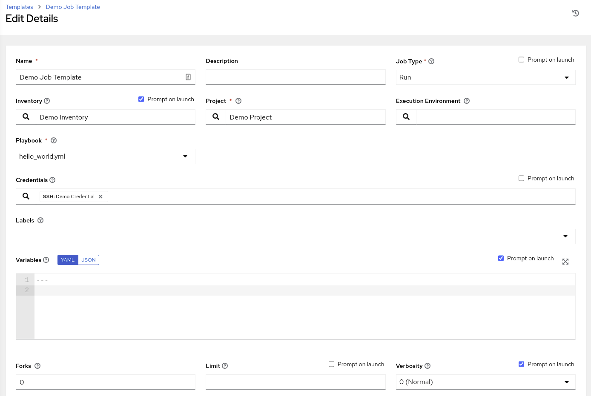

# AWX Resource Operator

[](https://opensource.org/licenses/Apache-2.0)
[](https://github.com/ansible/awx-resource-operator/actions)
[](https://docs.ansible.com/ansible/latest/community/code_of_conduct.html) 
[](https://groups.google.com/g/awx-project)
[](https://libera.chat)

An operator that can be used along side [Ansible AWX](https://github.com/ansible/awx) to launch automation jobs and create job templates by creating resources directly in kubernetes. This operator is built with [Operator SDK](https://github.com/operator-framework/operator-sdk) and Ansible.

## Table of Contents

* [AWX Resource Operator](#awx-resource-operator)
   * [Overview](#overview)
      * [Prerequisites](#prerequisites)
   * [Installing the Operator](#installing-the-operator)
   * [Usage](#usage)
      * [AnsibleJob](#ansiblejob)
      * [JobTemplate](#jobtemplate)
   * [Building and Testing](#building-and-testing)
   * [Author](#author)
   * [Code of Conduct](#code-of-conduct)
   * [Get Involved](#get-involved)

## Overview

There are currently two Custom Resources provided by the awx-resource-operator:

* AnsibleJob - launches a job in the AWX instance specified in the the specified k8s secret (awx host url, token)
* JobTemplate - creates a job template in the AWX instance specified.

### Prerequisites

* Install the kubernetes-based cluster of your choice:
  * [Openshift](https://docs.openshift.com/container-platform/4.11/installing/index.html)
  * [K8s](https://kubernetes.io/docs/setup/)
  * [CodeReady containers](https://access.redhat.com/documentation/en-us/red_hat_openshift_local/2.5)
  * [minikube](https://minikube.sigs.k8s.io/docs/start/)
* Deploy AWX using the [awx-operator](https://github.com/ansible/awx-operator#basic-install)
* Create an OAuth2 token for your user in the AWX UI


## Installing the Operator

1. Clone the awx-resource-operator

```
git clone git@github.com:ansible/awx-resource-operator.git
```

2. Log in to your cluster.

```
kubectl login <cluster-url>
```

3. Run the make target

```
NAMESPACE=awx IMG=quay.io/ansible/awx-resource-operator:latest make deploy
```

This will create a deployment named `resource-operator-controller-manager` in the namespace specified, in this case the `awx` namespace. The resulting operator pod will reconcile any AnsibleJob or JotTemplate resources created.


## Usage

Now that the awx-resource-operator is installed in your cluster, you can try creating a k8s resource to manage your AWX instance.

First, you need create a k8s secret with connection information for your AWX instance though. Below is example yaml that you can save to a file, edit, and apply to your cluster.

### Create an AWX Access Token

Create an OAuth2 token for your user in the AWX UI.

1. Navigate to Users
2. Select the username you wish to create a token for
3. Click on tokens, then the green plus icon
4. Application can be left empty, input a description and select the read/write scope.

> Alternatively, you can create one at the command-line using the `create_oauth2_token` manage command ([docs](https://docs.ansible.com/automation-controller/latest/html/administration/tower-manage.html#create-oauth2-token))

### Create a Connection Secret

To make this connection information available to the operator, create a k8s secret with the host and token value. Here is example yaml for the connection k8s secret.

```
---
apiVersion: v1
kind: Secret
metadata:
  name: awx-access
  type: Opaque
stringData:
  token: <generated-token>
  host: https://my-awx-host.example.com/
```

Save this to a file, for example, `awx-connection-secret.yml`, edit it with your host and token value, the apply it to your cluster.

```
kubectl create -f awx-connection-secret.yml
```

### AnsibleJob

Launch an automation job on AWX by creating an AnsibleJob resource. Be sure to specify the connection secret on `connection_secret` as well as the Job Template you wish to launch.

```
---
apiVersion: tower.ansible.com/v1alpha1
kind: AnsibleJob
metadata:
  generateName: demo-job-1 # generate a unique suffix per 'kubectl create'
spec:
  connection_secret: awx-access
  job_template_name: Demo Job Template
```

It is possible to configure other things like inventory, extra vars, and time to live for the job.

```
spec:
  connection_secret: awx-access
  job_template_name: Demo Job Template
  inventory: Demo Inventory                    # Inventory prompt on launch needs to be enabled
  runner_image: quay.io/ansible/awx-resource-runner
  runner_version: latest
  job_ttl: 100

  extra_vars:                                  # Extra variables prompt on launch needs to be enabled
     test_var: test

  job_tags: "provision,install,configuration"  # Specify tags to run
  skip_tags: "configuration,restart"           # Skip tasks with a given tag
```

Note that prompt on launch needs to be enabled for inventories and extra vars if you are specifying those. In order to enable "PROMPT ON LAUNCH", within the AWX UI:

1. Select Resources -> Templates
2. Within Templates, select your template and click the "PROMPT ON LAUNCH" checkbox next to INVENTORY and EXTRA VARIABLES.




#### Launching Workflows

Launch a Workflow Job Template with an AnsibleJob object by specifying the `workflow_template_name` instead of `job_template_name`.

```
---
apiVersion: tower.ansible.com/v1alpha1
kind: AnsibleJob
metadata:
  generateName: demo-job-1 # generate a unique suffix per 'kubectl create'
spec:
  connection_secret: awx-access
  name: Demo Workflow Template
```

### JobTemplate

Create a job template on AWX by creating a JobTemplate resource.

```
---
apiVersion: tower.ansible.com/v1alpha1
kind: JobTemplate
metadata:
  name: jobtemplate-4
spec:
  connection_secret: awx-access
  name: ExampleJobTemplate4
  project: Demo Project
  playbook: hello_world.yml
  inventory: Demo Inventory
```


## Building and Testing

If you have made changes to the operator and want to test them, you can do the following:

Build the operator image

```
make docker-build docker-push IMG=<your-registry>:dev
```

Deploy the operator

```
make deploy NAMESPACE=awx IMG=<your-registry>:dev
```

## Author

This maintained by the Red Hat Ansible Team.

## Code of Conduct

We ask all of our community members and contributors to adhere to the [Ansible code of conduct](http://docs.ansible.com/ansible/latest/community/code_of_conduct.html). If you have questions or need assistance, please reach out to our community team at [codeofconduct@ansible.com](mailto:codeofconduct@ansible.com)

## Get Involved

We welcome your feedback and ideas. The AWX resource operator uses the same mailing list and IRC channel as AWX itself. Here's how to reach us with feedback and questions:

- Join the `#ansible-awx` channel on irc.libera.chat
  * You can also join using Matrix and a client of your choice (Element is recommended) for a better experience ([more info here](https://hackmd.io/@ansible-community/community-matrix-faq))
- Join the [mailing list](https://groups.google.com/forum/#!forum/awx-project)
